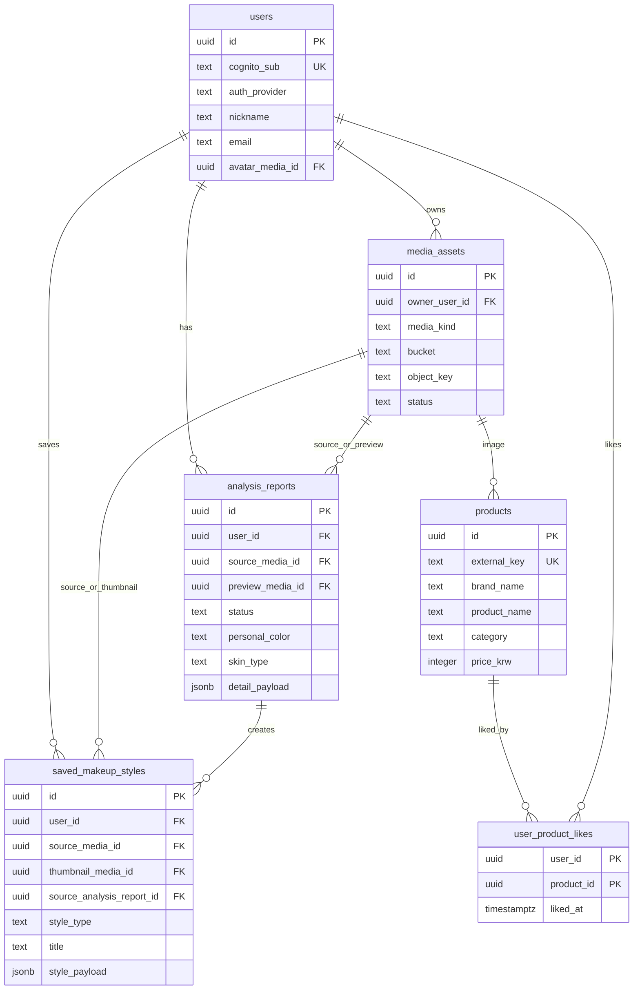

# DB Schema - Current App Scope

기준: `dev` branch `9b970eeae3882eddc0fb30980334425ba4ff694e`

검토 범위는 현재 React Native 앱에서 실제 라우팅되거나 화면 안에서 열리는 화면, 서비스, mock 데이터로 제한한다. 관리자, 결제, 리뷰, 팔로우, 커뮤니티, 알림, 쿠폰, 주문, 배송, 비밀번호, 자체 세션 저장은 현재 DB 설계에서 제외한다.

주의: 이 문서는 현재 구현 범위 기준의 DB 설계 초안이다. 아래 DDL은 검토용 문서이며 실제 PostgreSQL DB에 적용하지 않았다.

## 1. 설계 전 확인 질문

아래 항목은 답변 전까지 본 스키마에 복잡한 별도 테이블로 넣지 않는다.

1. 얼굴 진단 원본 사진과 필터 추출 원본 사진을 S3에 계속 보관할까요, 아니면 분석 완료 후 원본은 삭제하고 썸네일/리포트 이미지만 남길까요?
2. Product Recommendation 화면의 추천 결과는 매번 AI/API가 새로 생성하면 될까요, 아니면 사용자가 다시 볼 수 있도록 추천 결과 스냅샷을 DB에 저장해야 할까요?
3. AR 필터 목록과 AR 위치/스타일 옵션을 서버에서 관리해야 할까요, 아니면 현재처럼 앱/Unity 내부 config로 두고 사용자 저장 필터만 DB에 저장할까요?
4. Home의 "메이크업 피드백" 결과도 Analysis Report처럼 마이페이지/히스토리에 저장해야 할까요, 아니면 현재처럼 세션성 결과로만 둘까요?
5. Filter Save 화면의 "공개하기"는 실제 공개 피드/검색까지 의미하나요, 아니면 현재는 `visibility` 값만 저장하고 공개 노출 기능은 제외해도 될까요?

## 2. 가정

- AWS Cognito가 인증의 원천이다. PostgreSQL에는 비밀번호, refresh token, social account secret을 저장하지 않는다.
- `users.cognito_sub`가 Cognito user `sub`와 연결되는 유일한 인증 키다.
- Analysis Report 목록/상세/My Page가 이미 있으므로 얼굴 AI 분석 결과는 DB에 저장한다.
- Home hero, weekly trend, quick action, tutorial guide, loading step, validation message, selected tab, local toggle은 UI/config 데이터로 보고 DB에서 제외한다.
- 제품 좋아요 목록이 있으므로 제품과 사용자 좋아요 관계는 저장한다.
- Filter Extraction의 "저장된 필터/레시피가 마이페이지에서 다시 보인다"는 현재 플로우가 있으므로 사용자 저장 메이크업 스타일은 저장한다.
- Product Recommendation의 `matchRate`, `reason`, 추천 세트는 추천 응답에 가까우므로, 질문 2가 확정되기 전에는 별도 테이블로 만들지 않는다.
- AR 필터 카탈로그와 조정 옵션은 질문 3이 확정되기 전에는 앱/Unity config로 둔다.

## 3. 현재 앱에 존재하는 화면과 기능

| 영역 | 현재 화면/파일 | 현재 기능 | DB 판단 |
| --- | --- | --- | --- |
| Login | `LoginScreen` | Google/Kakao/Naver mock login | Cognito 연동 후 `users.cognito_sub` 매핑만 저장 |
| Tutorial | `TutorialIntroScreen`, `PhotoCaptureGuideScreen` | 진단 시작, 촬영 가이드, 개인정보 체크 UI | 가이드/체크 상태는 DB 제외 |
| Face Capture | `FaceCaptureScreen` | 카메라/앨범 진입, 촬영 가이드 상태 | 촬영 결과 파일은 S3, DB는 metadata |
| AI Analysis | `ImageAnalysisLoadingScreen` | 분석 진행 UI | 진행 단계는 UI 전용, 완료 결과는 `analysis_reports` |
| Analysis Report | `ImageAnalysisReportsListScreen`, `ImageAnalysisReportDetailScreen` | 리포트 목록/상세/공유/AR 필터 만들기 | `analysis_reports` 저장 |
| AR Filter | `ARMakeupFilterScreen`, `ARFilterCustomLocationScreen`, `ARFilterCustomStyleScreen` | 필터 선택, 비교, 위치/스타일 조정 | 기본 필터/옵션은 config, 사용자 저장 필터는 보류 또는 `saved_makeup_styles` |
| Home | `HomeScreen` | quick actions, trend, filter store, recommended looks | 현재 mock/config라 DB 제외 |
| My Page | `MyPageScreen` | 프로필, 최신 분석, 메이크업 스타일, 좋아요 제품 | `users`, `analysis_reports`, `saved_makeup_styles`, `user_product_likes` |
| Profile Edit | `ProfileEditScreen` | 이름, 닉네임, 전화번호, 이메일, 생년월일, 성별, 관심사 수정 UI | `users` 컬럼으로 저장 가능 |
| Makeup Style List | `MakeupStyleListScreen` | 메이크업 룩 목록 | 사용자 저장 항목은 `saved_makeup_styles`, mock 카탈로그는 제외 |
| Liked Product List | `LikedProductListScreen` | 좋아요 제품 목록 | `products`, `user_product_likes` |
| Product Recommendation | `ProductRecommendationScreen` | 추천 룩, 제품, 매치율, 추천 세트 | 제품은 `products`, 추천 결과 저장은 질문 2 전까지 제외 |
| Filter Extraction | `FilterImageUploadScreen` -> result/try-on/save/recipe | 사진 선택, 추출 결과, 필터/레시피 저장 | 원본/썸네일은 S3, 저장 결과는 `saved_makeup_styles.style_payload` |
| Makeup Feedback | `Feedback*`, `MakeupFeedbackScreen` | 사진 피드백 결과 표시 | 질문 4 전까지 DB 제외 |

## 4. 현재 기능 기준 저장 데이터

### 저장한다

- Cognito 사용자와 앱 프로필: 이름, 닉네임, 전화번호, 이메일, 생년월일, 성별, 관심사, 최근 퍼스널 컬러/피부 타입/피부 톤.
- S3 media metadata: 촬영 사진, 업로드 사진, 리포트 preview, 저장 스타일 thumbnail, profile avatar, product image.
- AI 분석 리포트: 분석 일시, 환경 라벨, 퍼스널 컬러, 피부 타입, 톤 요약, 추천 무드, 요약, 포인트 가이드, 추천/비추천 메이크업 카드.
- 제품 기본 정보: 브랜드명, 제품명, 호수/쉐이드, 카테고리, 가격, 이미지, 태그, 팔레트.
- 사용자 좋아요 제품 관계.
- 사용자 저장 메이크업 스타일/필터/레시피: 제목, 설명, 태그, 공개 설정, source media, 추출/AR/recipe payload.

### DB에서 제외한다

- 로그인 버튼 목록, loading/progress step, tutorial slide, capture guide check state.
- Home hero/trend/filter store/recommended look mock 데이터.
- AR 화면의 현재 선택 tab, guide mode, comparison mode, slider 값 같은 세션 상태.
- Product Recommendation의 정렬 선택, tab 선택, CTA press 상태.
- Profile Edit의 입력 validation message, calendar month, local notice.
- Feedback 결과 저장 여부가 확정되지 않은 피드백 result/callout/strength 데이터.

## 5. 현재 구현 범위 기준 테이블 목록

| 테이블 | 필요한 이유 |
| --- | --- |
| `users` | Cognito 사용자와 앱 프로필을 연결한다. My Page/Profile Edit/Report 날짜 표시에서 사용한다. |
| `media_assets` | 얼굴 사진 원본을 PostgreSQL에 넣지 않고 S3 key와 metadata만 저장한다. |
| `analysis_reports` | Analysis Report 목록/상세/My Page 최신 분석 결과를 조회한다. AI 결과 구조 변화는 `jsonb`로 흡수한다. |
| `products` | 추천 제품/좋아요 제품 화면에서 제품 기본 정보를 조회한다. |
| `user_product_likes` | 제품 `isLiked`를 사용자별 관계로 계산한다. |
| `saved_makeup_styles` | Filter Extraction 저장 결과와 My Page 메이크업 스타일을 연결한다. AR/filter/recipe payload는 `jsonb`로 저장한다. |

## 6. 테이블별 컬럼 설계

### `users`

| 컬럼 | 타입 | 설명 |
| --- | --- | --- |
| `id` | `uuid` PK | 내부 사용자 ID |
| `cognito_sub` | `text` unique | Cognito user sub |
| `auth_provider` | `text` | `google`, `kakao`, `naver` 등 |
| `name` | `text` | 이름 |
| `nickname` | `text` | 닉네임 |
| `phone` | `text` | 전화번호 |
| `email` | `text` | 이메일 |
| `birth_date` | `date` | 생년월일 |
| `gender` | `text` | 성별 |
| `interest` | `text` | 관심사 |
| `avatar_media_id` | `uuid` FK | 프로필 이미지 metadata |
| `personal_color` | `text` | 최근/대표 퍼스널 컬러 |
| `skin_type` | `text` | 최근/대표 피부 타입 |
| `skin_tone` | `text` | 최근/대표 피부 톤 |
| `tags` | `text[]` | My Page profile chip |
| `created_at`, `updated_at`, `deleted_at` | `timestamptz` | 생성/수정/탈퇴 처리 |

### `media_assets`

| 컬럼 | 타입 | 설명 |
| --- | --- | --- |
| `id` | `uuid` PK | media metadata ID |
| `owner_user_id` | `uuid` FK nullable | 사용자 소유 media. 제품/static asset이면 null 가능 |
| `media_kind` | `text` | `face_capture`, `filter_source`, `analysis_preview`, `saved_style_thumbnail`, `profile_avatar`, `product_image` |
| `source` | `text` | `camera`, `album`, `gallery`, `generated`, `catalog`, `mock_asset` 등 |
| `bucket` | `text` | S3 bucket |
| `object_key` | `text` | S3 object key |
| `cdn_url` | `text` nullable | CloudFront URL이 필요할 때 |
| `content_type` | `text` | MIME type |
| `byte_size` | `bigint` | 파일 크기 |
| `width`, `height` | `integer` | 이미지 크기 |
| `checksum_sha256` | `text` | 중복/무결성 확인 |
| `original_filename` | `text` | 업로드 원본 파일명 |
| `is_original` | `boolean` | 원본 여부 |
| `status` | `text` | `active`, `deleted`, `expired` |
| `created_at`, `deleted_at` | `timestamptz` | 생성/삭제 |

### `analysis_reports`

| 컬럼 | 타입 | 설명 |
| --- | --- | --- |
| `id` | `uuid` PK | 분석 리포트 ID |
| `user_id` | `uuid` FK | 리포트 소유자 |
| `source_media_id` | `uuid` FK nullable | 분석에 사용한 원본 사진 metadata |
| `preview_media_id` | `uuid` FK nullable | 목록/상세 표시용 이미지 |
| `status` | `text` | `queued`, `processing`, `completed`, `failed` |
| `ai_provider` | `text` | 기본 `bedrock` |
| `ai_model` | `text` nullable | Bedrock model ID |
| `lambda_request_id` | `text` nullable | Lambda/worker trace |
| `error_message` | `text` nullable | 실패 사유 |
| `analyzed_at` | `timestamptz` | 분석 완료 시각 |
| `title` | `text` | 카드 title |
| `report_title` | `text` | 상세 report title |
| `environment_label` | `text` | 촬영 환경 라벨 |
| `personal_color` | `text` | 퍼스널 컬러 |
| `skin_type` | `text` | 피부 타입 |
| `tone_summary` | `text` | 톤 요약 |
| `recommended_mood` | `text` | 추천 무드 |
| `summary` | `text` | 요약 |
| `short_summary` | `text` | 짧은 요약 |
| `skin_analysis_summary` | `text` | 피부 분석 문장 |
| `base_makeup_guide` | `text` | 베이스 가이드 |
| `tags` | `text[]` | 리포트 태그 |
| `detail_payload` | `jsonb` | `facePointGuide`, `recommendedMakeups`, `avoidedMakeups`, provider raw subset |
| `created_at`, `updated_at` | `timestamptz` | 생성/수정 |

### `products`

| 컬럼 | 타입 | 설명 |
| --- | --- | --- |
| `id` | `uuid` PK | 내부 제품 ID |
| `external_key` | `text` unique | mock id/API id 대응 |
| `brand_name` | `text` | 브랜드명 |
| `product_name` | `text` | 제품명 |
| `shade_name` | `text` nullable | 호수/쉐이드 |
| `category` | `text` nullable | `lip`, `cheek`, `shadow`, `liner`, `base` |
| `price_krw` | `integer` | 원화 가격 |
| `image_media_id` | `uuid` FK nullable | 제품 이미지 metadata |
| `tags` | `text[]` | 제품 태그 |
| `palette` | `text[]` | 화면 swatch hex |
| `product_payload` | `jsonb` | 화면 구조 변경 대비 보조 데이터 |
| `is_active` | `boolean` | 노출 여부 |
| `created_at`, `updated_at` | `timestamptz` | 생성/수정 |

`matchRate`, `reason`, 추천 세트는 제품 자체 속성이 아니라 추천 결과 속성이므로 현재 테이블에는 넣지 않는다.

### `user_product_likes`

| 컬럼 | 타입 | 설명 |
| --- | --- | --- |
| `user_id` | `uuid` PK/FK | 사용자 |
| `product_id` | `uuid` PK/FK | 제품 |
| `liked_at` | `timestamptz` | 좋아요 시각 |

### `saved_makeup_styles`

| 컬럼 | 타입 | 설명 |
| --- | --- | --- |
| `id` | `uuid` PK | 저장 스타일 ID |
| `user_id` | `uuid` FK | 소유자 |
| `source_media_id` | `uuid` FK nullable | 추출 원본 사진 |
| `thumbnail_media_id` | `uuid` FK nullable | 카드 thumbnail |
| `source_analysis_report_id` | `uuid` FK nullable | 분석 리포트에서 생성된 경우 |
| `style_type` | `text` | `makeup_look`, `extracted_filter`, `recipe` |
| `title` | `text` | 스타일/필터명 |
| `mood_label` | `text` | mood label |
| `short_description` | `text` | 카드 설명 |
| `tags` | `text[]` | 저장 태그 |
| `visibility` | `text` | `private`, `public` |
| `style_payload` | `jsonb` | 추출 결과, palette, points, AR settings, recipe items |
| `saved_at` | `timestamptz` | 저장 시각 |
| `archived_at` | `timestamptz` nullable | 저장 해제/숨김 |
| `created_at`, `updated_at` | `timestamptz` | 생성/수정 |

## 7. 테이블 관계

- `users` 1:N `media_assets`
- `users` 1:N `analysis_reports`
- `media_assets` 1:N `analysis_reports` as source/preview image
- `users` 1:N `saved_makeup_styles`
- `media_assets` 1:N `saved_makeup_styles` as source/thumbnail image
- `analysis_reports` 1:N `saved_makeup_styles` when a report creates a filter/style
- `users` N:M `products` through `user_product_likes`

## 8. Mermaid ERD



## 9. PostgreSQL DDL 초안

```sql
CREATE EXTENSION IF NOT EXISTS pgcrypto;

CREATE TABLE users (
    id uuid PRIMARY KEY DEFAULT gen_random_uuid(),
    cognito_sub text NOT NULL UNIQUE,
    auth_provider text,
    name text,
    nickname text,
    phone text,
    email text,
    birth_date date,
    gender text,
    interest text,
    avatar_media_id uuid,
    personal_color text,
    skin_type text,
    skin_tone text,
    tags text[] NOT NULL DEFAULT ARRAY[]::text[],
    created_at timestamptz NOT NULL DEFAULT now(),
    updated_at timestamptz NOT NULL DEFAULT now(),
    deleted_at timestamptz
);

CREATE TABLE media_assets (
    id uuid PRIMARY KEY DEFAULT gen_random_uuid(),
    owner_user_id uuid REFERENCES users(id) ON DELETE SET NULL,
    media_kind text NOT NULL CHECK (
        media_kind IN (
            'face_capture',
            'filter_source',
            'analysis_preview',
            'saved_style_thumbnail',
            'profile_avatar',
            'product_image'
        )
    ),
    source text,
    bucket text NOT NULL,
    object_key text NOT NULL,
    cdn_url text,
    content_type text,
    byte_size bigint CHECK (byte_size IS NULL OR byte_size >= 0),
    width integer CHECK (width IS NULL OR width > 0),
    height integer CHECK (height IS NULL OR height > 0),
    checksum_sha256 text,
    original_filename text,
    is_original boolean NOT NULL DEFAULT true,
    status text NOT NULL DEFAULT 'active' CHECK (status IN ('active', 'deleted', 'expired')),
    created_at timestamptz NOT NULL DEFAULT now(),
    deleted_at timestamptz,
    UNIQUE (bucket, object_key)
);

ALTER TABLE users
    ADD CONSTRAINT users_avatar_media_id_fkey
    FOREIGN KEY (avatar_media_id) REFERENCES media_assets(id) ON DELETE SET NULL;

CREATE TABLE analysis_reports (
    id uuid PRIMARY KEY DEFAULT gen_random_uuid(),
    user_id uuid NOT NULL REFERENCES users(id) ON DELETE CASCADE,
    source_media_id uuid REFERENCES media_assets(id) ON DELETE SET NULL,
    preview_media_id uuid REFERENCES media_assets(id) ON DELETE SET NULL,
    status text NOT NULL DEFAULT 'queued'
        CHECK (status IN ('queued', 'processing', 'completed', 'failed')),
    ai_provider text NOT NULL DEFAULT 'bedrock',
    ai_model text,
    lambda_request_id text,
    error_message text,
    analyzed_at timestamptz,
    title text,
    report_title text,
    environment_label text,
    personal_color text,
    skin_type text,
    tone_summary text,
    recommended_mood text,
    summary text,
    short_summary text,
    skin_analysis_summary text,
    base_makeup_guide text,
    tags text[] NOT NULL DEFAULT ARRAY[]::text[],
    detail_payload jsonb NOT NULL DEFAULT '{}'::jsonb,
    created_at timestamptz NOT NULL DEFAULT now(),
    updated_at timestamptz NOT NULL DEFAULT now()
);

CREATE TABLE products (
    id uuid PRIMARY KEY DEFAULT gen_random_uuid(),
    external_key text UNIQUE,
    brand_name text NOT NULL,
    product_name text NOT NULL,
    shade_name text,
    category text CHECK (
        category IS NULL OR category IN ('lip', 'cheek', 'shadow', 'liner', 'base')
    ),
    price_krw integer CHECK (price_krw IS NULL OR price_krw >= 0),
    image_media_id uuid REFERENCES media_assets(id) ON DELETE SET NULL,
    tags text[] NOT NULL DEFAULT ARRAY[]::text[],
    palette text[] NOT NULL DEFAULT ARRAY[]::text[],
    product_payload jsonb NOT NULL DEFAULT '{}'::jsonb,
    is_active boolean NOT NULL DEFAULT true,
    created_at timestamptz NOT NULL DEFAULT now(),
    updated_at timestamptz NOT NULL DEFAULT now()
);

CREATE TABLE user_product_likes (
    user_id uuid NOT NULL REFERENCES users(id) ON DELETE CASCADE,
    product_id uuid NOT NULL REFERENCES products(id) ON DELETE CASCADE,
    liked_at timestamptz NOT NULL DEFAULT now(),
    PRIMARY KEY (user_id, product_id)
);

CREATE TABLE saved_makeup_styles (
    id uuid PRIMARY KEY DEFAULT gen_random_uuid(),
    user_id uuid NOT NULL REFERENCES users(id) ON DELETE CASCADE,
    source_media_id uuid REFERENCES media_assets(id) ON DELETE SET NULL,
    thumbnail_media_id uuid REFERENCES media_assets(id) ON DELETE SET NULL,
    source_analysis_report_id uuid REFERENCES analysis_reports(id) ON DELETE SET NULL,
    style_type text NOT NULL DEFAULT 'makeup_look'
        CHECK (style_type IN ('makeup_look', 'extracted_filter', 'recipe')),
    title text NOT NULL,
    mood_label text,
    short_description text,
    tags text[] NOT NULL DEFAULT ARRAY[]::text[],
    visibility text NOT NULL DEFAULT 'private'
        CHECK (visibility IN ('private', 'public')),
    style_payload jsonb NOT NULL DEFAULT '{}'::jsonb,
    saved_at timestamptz NOT NULL DEFAULT now(),
    archived_at timestamptz,
    created_at timestamptz NOT NULL DEFAULT now(),
    updated_at timestamptz NOT NULL DEFAULT now()
);

CREATE INDEX idx_media_assets_owner_kind
    ON media_assets (owner_user_id, media_kind, created_at DESC);

CREATE INDEX idx_analysis_reports_user_analyzed_at
    ON analysis_reports (user_id, analyzed_at DESC);

CREATE INDEX idx_analysis_reports_user_status
    ON analysis_reports (user_id, status);

CREATE INDEX idx_products_category_active
    ON products (category, is_active);

CREATE INDEX idx_saved_makeup_styles_user_saved_at
    ON saved_makeup_styles (user_id, saved_at DESC)
    WHERE archived_at IS NULL;

CREATE INDEX idx_analysis_reports_tags_gin
    ON analysis_reports USING gin (tags);

CREATE INDEX idx_saved_makeup_styles_tags_gin
    ON saved_makeup_styles USING gin (tags);
```

## 10. S3와 PostgreSQL 저장 구분

### S3에 저장

- 얼굴 진단 원본 사진.
- 필터 추출에 사용한 업로드/앨범/카메라 사진.
- 분석 리포트 preview image 또는 생성 thumbnail.
- 저장한 메이크업 스타일/필터 thumbnail.
- 프로필 avatar 이미지.
- 제품 이미지가 서버/CloudFront에서 관리될 경우 제품 image asset.

### PostgreSQL에 저장

- S3 bucket/key, CDN URL, 파일 크기, MIME type, width/height, checksum 같은 media metadata.
- 사용자 프로필과 Cognito sub.
- 분석 리포트의 화면 표시 필드와 AI 결과 `jsonb`.
- 제품의 화면 표시 필드.
- 사용자별 제품 좋아요.
- 사용자 저장 메이크업 스타일/필터/레시피의 화면 표시 필드와 payload.

## 11. pgvector 판단

### 지금은 안 써도 되는 경우

- 현재 Product Recommendation mock은 이미 `matchRate`가 주어진 화면 데이터다.
- 현재 앱에는 벡터 기반 검색 UI, 유사 이미지 검색 UI, 상품 임베딩 관리 UI가 없다.
- 현재 DB 설계는 제품/리포트/저장 스타일을 저장하고 조회하는 수준이다.

따라서 현재 DDL에는 `vector` 컬럼을 넣지 않는다.

### 써야 하는 경우

- 제품 추천을 "사용자 분석 결과 embedding"과 "제품/룩 embedding"의 유사도 검색으로 구현하기로 결정한 경우.
- 필터 추출 이미지와 유사한 저장 룩/제품을 검색해야 하는 경우.
- Bedrock 또는 별도 embedding 모델 결과를 PostgreSQL에서 ANN 검색해야 하는 경우.

그때는 `products`, `saved_makeup_styles`, 또는 별도 `embeddings` 테이블에 `vector(n)` 컬럼과 HNSW/IVFFlat index를 추가한다.

## 12. 지금은 제외할 테이블/기능

- `passwords`, `user_passwords`, `auth_sessions`, `refresh_tokens`: Cognito 담당.
- `admin_users`, `admin_audit_logs`: 현재 admin 앱은 `.gitkeep`만 존재.
- `orders`, `payments`, `shipping_addresses`, `coupons`: 현재 화면 없음.
- `reviews`, `comments`, `follows`, `communities`, `notifications`: 현재 화면 없음.
- `product_recommendation_results`: 추천 결과 저장 여부 질문 2 전까지 제외.
- `ar_filter_catalog`, `ar_filter_options`: 질문 3 전까지 앱/Unity config.
- `makeup_feedback_reports`: 질문 4 전까지 제외.
- `public_filter_feed`: 질문 5 전까지 제외.
- `consent_records`: 현재 촬영 가이드 체크는 화면 진행 gate로만 보고 제외. 법적 동의 보관이 필요하면 추후 분리.

## 13. 나중에 확장 시 분리할 테이블

본 설계에 섞지 않고, 필요해지는 시점에만 추가한다.

| 확장 테이블 | 추가 시점 |
| --- | --- |
| `ai_jobs` | 분석/추천/피드백/필터 추출을 공통 async job으로 추적해야 할 때 |
| `product_recommendation_results` | 추천 결과를 재조회하거나 사용자별 추천 히스토리로 보관할 때 |
| `ar_filter_catalog`, `ar_filter_options` | AR 필터 목록과 옵션을 서버에서 운영해야 할 때 |
| `makeup_feedback_reports` | 메이크업 피드백 결과를 My Page나 히스토리에 저장할 때 |
| `makeup_style_recipes` | 레시피 단계 검색/수정이 필요해져 `style_payload`로 부족할 때 |
| `product_embeddings`, `style_embeddings` | pgvector 기반 유사도 검색을 실제로 도입할 때 |
| `consent_records` | 촬영/민감정보 동의 이력을 법적 감사 목적으로 보관해야 할 때 |
