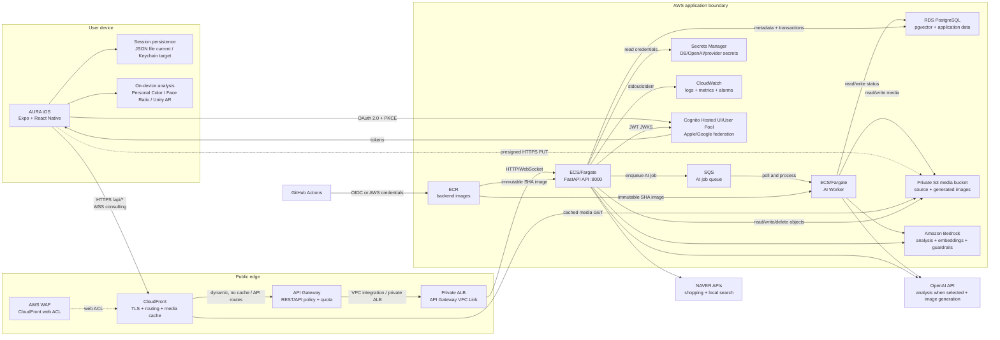
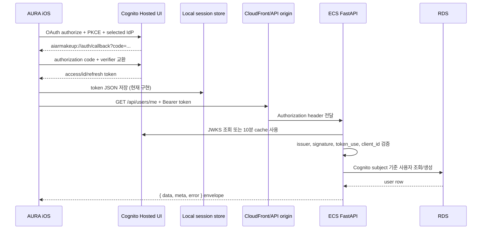
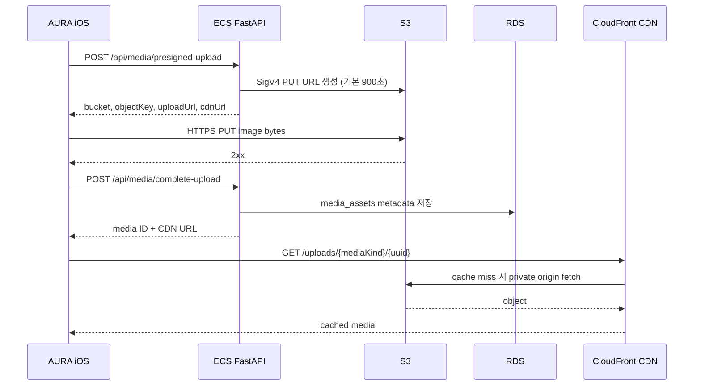
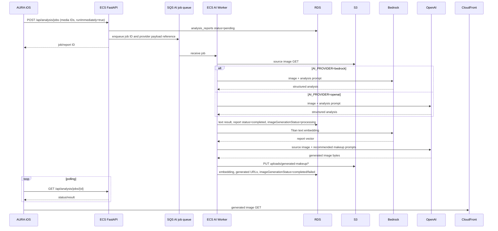
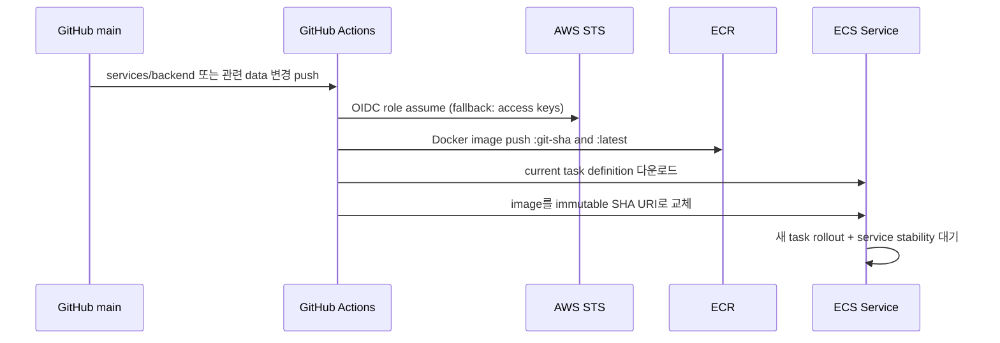

# AURA Production Architecture

문서 상태: `Production target + current implementation contract`

기준 브랜치: `origin/dev` (`fed9a47`)

최종 검증일: `2026-07-10`

대상: iOS AURA 앱, AWS 진입 계층, FastAPI/ECS, RDS/S3, OpenAI/Bedrock

## 1. 목적과 범위

이 문서는 AURA iOS 앱에서 시작한 요청이 CloudFront와 WAF를 거쳐 API Gateway와 비공개
ALB를 통해 ECS/FastAPI로 전달되고, ECS/FastAPI가 RDS·S3와 연동하는 전체 운영 구성을
정의한다. API Gateway는 짧은 API 요청과 AI 작업 등록을 담당하고, 장시간 AI 작업은
ECS/FastAPI가 SQS에 등록한 뒤 별도 ECS AI Worker가 OpenAI·Bedrock에서 처리한다.
상담용 WebSocket은 API Gateway 또는 연결된 비공개 ALB 경로에서 upgrade와 timeout을 검증한다.
인증, 미디어 업로드, 얼굴 분석, 메이크업 피드백, 레퍼런스 메이크업 추출,
추천, 커뮤니티, 상담 및 삭제 흐름도 함께 다룬다.

실제 AWS 계정의 리소스 상태를 설명하는 문서는 아니다. 현재 저장소의 `infra/`에는
IaC가 없으며, CloudFront, WAF, API Gateway, 비공개 ALB, ECS, SQS, RDS, S3, Cognito,
Secrets Manager, CloudWatch 리소스는 저장소 밖에서 생성·구성해야 한다.

실제 secret 값, 사용자 토큰, 운영 계정, 개인 데이터는 이 문서나 Git에 기록하지 않는다.

### 1.1 초기 용량·동시성 기준

초기 운영 환경은 최대 200명의 사용자가 동시에 앱을 사용하는 상황을 기준으로 설계한다. 단, 사용자가
200명이라고 해서 API 요청이나 AI 작업이 200개 동시에 발생하는 것은 아니므로, 실제 서버 처리량은 부하
테스트를 통해 확인해야 한다. OpenAI와 Bedrock의 요청 한도와 비용도 함께 확인한 뒤 최종 운영 기준을
확정한다.

- 운영 목표는 같은 백엔드 서버 2개를 동시에 실행해, 한 서버에 장애가 발생해도 다른 서버가 요청을 처리하도록
  하는 것이다. 다만 현재는 서버 간에 AI 작업과 상담 상태를 공유하지 못하므로, 작업 큐와 공용 상태 저장소를
  추가한 뒤 이 구성을 production 운영에 사용한다.
- 상담 WebSocket은 200개 동시 연결, 재연결 폭주, idle timeout, room broadcast를 실부하로 검증한다.
- AI 작업량은 200명 동시접속과 별도로 제한한다. 초기 제안은 사용자 1명당 동시에 AI 작업 1개,
  전체 서비스에서 동시에 처리하는 AI 작업 10개이다. 10개가 모두 실행 중이면 이후 작업은 durable
  queue에서 대기시키고, 앱에는 `대기 중`·`처리 중`·`완료`·`실패` 상태를 표시한다. 이 숫자는 초기
  운영 기준이므로 OpenAI·Bedrock의 실제 요청 한도와 부하 테스트 결과를 확인한 뒤 최종 확정한다.
- 이미지 업로드 용량은 동시 사용자 수뿐 아니라 이미지 크기, 업로드 빈도, 저장소와 콘텐츠 전송
  계층의 처리량을 함께 고려해 정한다.

출시 전에는 사용자 200명 동시 사용, 주요 API 요청 집중, WebSocket 200개 연결, 이미지 업로드, AI 작업
동시 처리, ECS·RDS 장애 복구 상황을 시험한다. 각 테스트의 합격 기준과 예상 비용은
[CAPACITY_AND_COST_PLAN.md](./CAPACITY_AND_COST_PLAN.md)에서 정하고 승인한다.

### 1.2 관련 운영 문서

| 영역 | 문서 |
| --- | --- |
| 앱·백엔드 배포와 복구 | [DEPLOYMENT_AND_ROLLBACK_RUNBOOK.md](./DEPLOYMENT_AND_ROLLBACK_RUNBOOK.md) |
| SLO·대시보드·알람 | [MONITORING_SLO_ALERTS.md](./MONITORING_SLO_ALERTS.md) |
| 장애 대응과 사후 분석 | [INCIDENT_RESPONSE.md](./INCIDENT_RESPONSE.md) |
| RDS/S3 백업과 DR | [BACKUP_RESTORE_DR.md](./BACKUP_RESTORE_DR.md) |
| IAM·secret·접근 통제 | [SECURITY_AND_ACCESS_CONTROL.md](./SECURITY_AND_ACCESS_CONTROL.md) |
| 데이터 보유와 삭제 | [DATA_RETENTION_AND_DELETION_RUNBOOK.md](./DATA_RETENTION_AND_DELETION_RUNBOOK.md) |
| 고객 문의와 escalation | [CUSTOMER_SUPPORT_RUNBOOK.md](./CUSTOMER_SUPPORT_RUNBOOK.md) |
| 용량·quota·비용 | [CAPACITY_AND_COST_PLAN.md](./CAPACITY_AND_COST_PLAN.md) |
| 배포 변경 이력 | [RELEASE_NOTES.md](./RELEASE_NOTES.md) |

## 2. 상태 표기

| 표기 | 의미 |
| --- | --- |
| `IMPLEMENTED` | 애플리케이션 코드 또는 배포 워크플로에 동작이 구현되어 있다. |
| `DEPLOYMENT CONTRACT` | 코드가 전제하는 운영 구성이나 환경 변수지만 저장소가 리소스를 생성하지는 않는다. |
| `DECISION REQUIRED` | 운영 전에 팀이 하나의 방식을 선택하고 기록해야 한다. |
| `HARDENING REQUIRED` | 데모·단일 인스턴스에서는 동작할 수 있으나 안정적인 운영 전에 보강해야 한다. |

충돌 시 소스 오브 트루스 우선순위는 다음과 같다.

1. 실행 코드와 배포 워크플로
2. `docs/backend/schema.sql`과 실제 FastAPI route
3. 이 문서
4. 재생성 후 contract 검증을 통과한 `docs/backend/openapi.json`
5. 계획 문서와 과거 설계 문서

현재 committed OpenAPI artifact는 일부 최신 community/consulting/search/delete route보다 오래될 수
있으므로 재생성 전에는 전체 runtime route 목록으로 간주하지 않는다.

## 3. 전체 구성



### 3.1 핵심 원칙

- iOS 앱의 운영 API 기준 URL은 `https://<cloudfront-domain>/api`이다.
- CloudFront에는 비즈니스 로직을 두지 않는다. WAF 규칙 적용, HTTPS, 헤더 전달, 캐시 정책과
  API Gateway·S3 origin 라우팅만 담당한다.
- API Gateway는 짧은 API 요청과 요청량 제한을 처리하고, 비공개 ALB와 VPC integration으로 ECS API에
  연결한다. 장시간 AI 작업은 FastAPI가 SQS에 등록하고 별도 AI Worker가 처리한다.
- 원본 미디어 바이트는 일반 API 요청 본문을 통과하지 않는다. iOS가 FastAPI에서
  presigned URL을 받은 뒤 S3에 직접 `PUT`한다.
- RDS에는 사용자·업무 데이터와 S3 객체의 메타데이터를 저장하고, 큰 바이너리는 S3에 둔다.
- OpenAI 및 Bedrock 자격증명은 iOS에 포함하지 않는다. 모든 AI 호출은 ECS AI Worker에서 수행한다.

## 4. 진입 계층과 네트워크

### 4.1 CloudFront 동작 계약

| 경로/트래픽 | Origin | 캐시 | 필수 전달 값 |
| --- | --- | --- | --- |
| `/api/*` REST | API Gateway → VPC integration → 비공개 ALB | 비활성화 | `Authorization`, `Content-Type`, `Origin`, 필요한 CORS 헤더 |
| `/api/consulting/ws/*` WSS | API Gateway WebSocket 또는 연결된 비공개 ALB 경로 | 비활성화 | Upgrade 연결, query string, 연결 타임아웃 정책 |
| `/uploads/*` 등 미디어 GET | private S3 origin | 장기 캐시 가능 | 객체 경로, 적절한 응답 Content-Type |
| `/health` | API Gateway → 비공개 ALB | 비활성화 | 인증 없이 상태 코드 확인 |

CloudFront에서 동적 API 응답을 캐시하면 사용자별 응답이나 인증 결과가 섞일 수 있으므로
`/api/*`는 캐시하지 않는다. S3 origin은 Origin Access Control 같은 방식으로 비공개 버킷에만
접근하도록 구성하고, S3 웹 공개 읽기는 사용하지 않는다.

### 4.2 CloudFront, WAF, API Gateway, 비공개 ALB

production 기본 경로는 `CloudFront + WAF → API Gateway → VPC integration → 비공개 ALB →
ECS/FastAPI`로 구성한다. CloudFront WAF web ACL에서 공통 차단·rate limit 규칙을 적용하고,
API Gateway는 짧은 API 요청과 요청량 제한을 처리한다. API Gateway의 VPC Link/integration으로
private subnet의 ALB에 연결해 ALB와 ECS를 외부에 직접 공개하지 않는다.

API Gateway의 실제 protocol(HTTP API 또는 REST API), VPC Link, integration timeout과 throttling은
계정 설정에서 확인한다. 장시간 AI 작업은 API Gateway 응답을 오래 유지하지 않고 SQS job을 등록한
뒤 job ID를 즉시 반환한다. Worker 결과는 polling 또는 WebSocket으로 전달한다.

현재 코드의 상담 기능은 `/api/consulting/ws/bookings/{bookingId}`에 native WebSocket을 연다.
API Gateway WebSocket 또는 API Gateway와 연결된 비공개 ALB 경로가 upgrade, idle timeout, query
string 전달을 보존하는지 staging에서 검증해야 한다.

### 4.3 권장 VPC 경계

다음 항목은 `DEPLOYMENT CONTRACT`이며 현재 저장소가 생성하지 않는다.

- ECS task와 RDS는 private subnet에 배치한다.
- RDS security group은 ECS task security group의 PostgreSQL `5432` 접근만 허용한다.
- API Gateway는 VPC Link/integration으로 비공개 ALB에 연결하고, 비공개 ALB target group은 ECS API
  container port `8000`으로 연결한다.
- SQS queue는 ECS API task가 작업을 등록하고 ECS AI Worker가 polling하도록 구성한다. Worker는
  RDS에 작업 상태를 기록하고 S3·OpenAI·Bedrock에 접근한다.
- ECS outbound는 S3, Secrets Manager, Bedrock, Cognito JWKS, OpenAI, NAVER API에 필요하다.
  AWS 서비스에는 VPC endpoint를 우선 검토하고 OpenAI/NAVER 같은 외부 HTTPS에는 NAT 경로가 필요하다.
- S3 버킷은 public access block을 유지하고 전송·저장 암호화를 사용한다.
- RDS는 TLS 연결, 자동 백업, point-in-time recovery와 운영 복구 절차를 구성한다.

## 5. 컴포넌트 책임

| 컴포넌트 | 책임 | 상태 |
| --- | --- | --- |
| AURA iOS | 카메라/앨범/AR UI, 로컬 분석, API 호출, S3 직접 업로드, 결과 렌더링 | `IMPLEMENTED`; token storage 보강 필요 |
| Cognito | Hosted UI, Apple/Google 등 IdP 연동, OAuth code 교환, JWT 발급 | `DEPLOYMENT CONTRACT` |
| CloudFront | 단일 공개 도메인, `/api/*` origin routing, S3 CDN, TLS | `DEPLOYMENT CONTRACT` |
| AWS WAF | CloudFront web ACL, 공통 차단·rate limit 규칙 | `DEPLOYMENT CONTRACT` |
| API Gateway | 짧은 REST 요청, 인증·쿼터·throttling 정책, VPC integration | `DEPLOYMENT CONTRACT`; 실제 protocol·timeout 확인 필요 |
| Private ALB | API Gateway VPC Link 뒤에서 REST 및 상담 WebSocket을 ECS로 전달 | `DEPLOYMENT CONTRACT` |
| ECS/Fargate API | FastAPI, JWT 검증, DB transaction, S3 연동, AI 작업 등록 | 코드와 배포 workflow `IMPLEMENTED`; 실제 service는 외부 구성 |
| SQS | 장시간 AI 작업을 durable queue에 보관 | `HARDENING REQUIRED`; 현재 BackgroundTasks 대체 필요 |
| ECS/Fargate AI Worker | SQS 작업 수신, OpenAI/Bedrock 호출, 결과·상태 저장 | `HARDENING REQUIRED`; 별도 worker 구성 필요 |
| RDS PostgreSQL | 사용자·미디어 메타데이터·분석·추천·커뮤니티·상담 데이터 | schema `IMPLEMENTED`; 실제 RDS는 외부 구성 |
| S3 | 원본 사진, 썸네일, 생성 메이크업 이미지 | API integration `IMPLEMENTED`; 실제 bucket은 외부 구성 |
| Bedrock | 기본 이미지 분석, Titan embedding, guardrail, 추천 문구 | `IMPLEMENTED`, 자격증명·모델 접근 필요 |
| OpenAI | 선택적 텍스트/비전 분석, 추천 메이크업 이미지 생성 | `IMPLEMENTED`, API key·model access 필요 |
| Secrets Manager | RDS secret 및 ECS secret injection | DB secret 읽기 `IMPLEMENTED`; task mapping은 외부 구성 |
| CloudWatch | ECS stdout/stderr, service/ALB metrics, alarms | 로그 계약만 존재, alarm은 `HARDENING REQUIRED` |
| GitHub Actions/ECR | main 변경을 SHA tag 이미지로 빌드·배포 | `IMPLEMENTED` |

## 6. 인증 흐름



운영 필수 설정은 다음과 같다.

- iOS: `EXPO_PUBLIC_COGNITO_CLIENT_ID`, Cognito domain/region, redirect URI, IdP 이름
- ECS: `AUTH_REQUIRED=true`, `COGNITO_USER_POOL_ID`, `COGNITO_APP_CLIENT_ID`
- Cognito callback URL: `aiarmakeup://auth/callback`

`AUTH_REQUIRED`의 기본값은 `false`이므로 production에서 누락되면 개발용 사용자로 인증이
우회된다. 배포 전 `/api/health/config`와 task definition을 통해 반드시 `true`임을 확인한다.

현재 `localSecureStore` 구현은 이름과 호출 옵션과 달리 `expo-secure-store`/Keychain을 사용하지
않고 앱 document directory의 JSON 파일에 access/id/refresh token을 저장한다. production 전
실제 iOS Keychain 기반 저장소로 교체하고 기존 평문 fallback 파일의 migration·삭제를 검증한다.
refresh token은 저장되지만 refresh grant가 구현되어 있지 않고, logout은 로컬 session만 지우며
Cognito revocation endpoint를 호출하지 않는다. refresh·revoke·provider credential disconnect를
인증 수명주기 계약에 포함한다.

현재 React Native WebSocket 클라이언트는 JWT를 query string으로 전달한다. URL은 proxy와
access log에 남을 수 있으므로 production에서는 short-lived WebSocket ticket 또는 안전한
header/subprotocol 전달 방식으로 교체하고, 전환 전에는 query string을 로그에서 제거한다.

## 7. 미디어 업로드와 조회 흐름



커뮤니티 이미지는 앱에서 별도 JPEG 썸네일을 만들고 원본과 썸네일을 각각 presigned upload한
뒤 두 객체의 메타데이터를 RDS에 연결한다. 얼굴 촬영은 추가로 `/api/photo-captures`를 호출해
`photo_captures`와 `media_assets`를 연결한다.

현재 얼굴 분석 촬영은 사용자가 최종 확인 화면에서 분석 진행을 확정하기 전에 S3 upload와 RDS
등록이 끝날 수 있다. 명시적 동의 시점과 업로드 시점을 맞추거나, 확인 취소 시 즉시 정리하는
보상 transaction을 추가한다. `photo_captures.device_payload`에 device-local `sourceUri` 같은 값도
저장되므로 서버에 불필요한 로컬 경로는 제거한다.

현재 `S3Service`는 모든 업로드에 `public, max-age=31536000, immutable` cache-control을
사용한다. 원본 얼굴 사진처럼 민감한 비공개 미디어와 공개 커뮤니티/생성 이미지를 같은 캐시
정책으로 운영해서는 안 된다. production 전 다음 정책을 분리한다.

- 원본 얼굴·피드백·상담 이미지: private/no-store 또는 짧은 signed read URL
- 공개하기로 동의한 커뮤니티 미디어: CDN 장기 캐시 가능
- 생성 결과 이미지: 제품 정책과 삭제 SLA에 맞는 versioned cache
- 삭제 시 CloudFront cache 무효화 또는 접근 차단 방식 정의

현재 presign 요청은 content type과 media kind를 폭넓게 받고, `complete-upload`는 client가 보낸
bucket, object key, CDN URL, size/checksum을 S3 `HEAD`로 재검증하지 않고 RDS에 기록한다.
production에서는 presign 발급 내역을 사용자와 연결하고, 허용 bucket/prefix/type/size를 제한하며,
complete 시 실제 object 존재·소유권·크기·hash를 검증한다. PUT 성공 후 complete 실패로 남는 orphan
object는 S3 lifecycle 또는 scheduled cleanup으로 제거한다.

## 8. 얼굴 분석 및 AI 생성 흐름



기본 설정은 `AI_PROVIDER=bedrock`, `IMAGE_GENERATION_PROVIDER=openai`이다. 즉 얼굴 분석 텍스트와
구조화 결과는 Bedrock이 처리하고, 추천 메이크업 이미지는 OpenAI image API가 처리한다.
`AI_PROVIDER=openai`로 바꾸면 분석도 OpenAI Responses API를 사용한다.

Bedrock model은 환경에 따라 cross-region inference profile을 사용할 수 있으므로 처리 지역이 항상
서울 리전에만 머문다고 가정하지 않는다. Bedrock guardrail도 모든 AI 경로에 일괄 적용되는 것이
아니라 피드백·추천 등 연결된 경로에만 적용된다. 실제 model, inference region, guardrail coverage를
privacy data map과 배포 설정에서 별도로 확정한다.

현재 즉시 분석과 이미지 생성은 ECS 프로세스의 FastAPI `BackgroundTasks`에서 실행된다.
production에서는 이 경로를 SQS와 별도 ECS AI Worker로 옮겨 task 재시작, deploy, scale-in 중에도
작업을 보존한다. 모바일에 공개된 job/report 계약은 유지할 수 있다.

report의 최상위 `status=completed`는 텍스트/구조화 분석 완료를 뜻하며 추천 이미지 생성 완료를
보장하지 않는다. 이미지 생성은 중첩된 `imageGenerationStatus`가 `processing`, `completed`, `failed`
중 하나로 별도 진행된다. iOS polling, QA와 운영 alarm은 두 상태를 함께 판단해야 한다.

## 9. 기능별 데이터 흐름

| 기능 | 입력 | 처리 경로 | 저장/출력 | 외부 전송 |
| --- | --- | --- | --- | --- |
| 로그인·프로필 | OAuth subject, email, name, profile | iOS ↔ Cognito, iOS → API | token은 현재 local JSON, profile은 RDS `users` | Cognito/연동 IdP |
| 퍼스널 컬러 | 카메라 프레임, 피부·헤어·입술 색 | iOS native/JS 로컬 처리 | 로컬 결과·artifact | 코드 기준 backend 호출 없음 |
| 얼굴 비율·세로 3분할 | 카메라 프레임, landmarks/matte | iOS native/JS 로컬 처리 | 측정값은 분석 요청 metadata에 포함 가능 | 분석 요청 시 파생값이 ECS/AI로 전달될 수 있음 |
| 얼굴 분석 | 얼굴 원본, capture/media ID, 로컬 파생값 | iOS → S3 → ECS → Bedrock/OpenAI | RDS `analysis_reports`, S3 생성 이미지 | 선택된 AI provider, OpenAI image API |
| 메이크업 피드백 | 사용자 사진, 목표 텍스트 | iOS → S3 → ECS → Bedrock + guardrail | RDS `makeup_feedback_reports` | Bedrock |
| 레퍼런스 메이크업 추출 | 앨범/카메라 이미지 | iOS → S3 → ECS → Bedrock, 상품 enrichment | RDS `filter_extraction_reports` | Bedrock, 필요 시 NAVER |
| 상품 추천/Auradin | profile, 질의·선택 | ECS catalog/RDS + Bedrock embedding/copy + NAVER | RDS 또는 설정에 따른 session store, 응답 JSON | Bedrock, NAVER Shopping |
| 커뮤니티 | 글·댓글·사진·행동 event | iOS → API/S3 → RDS, Bedrock embedding | community tables, media_assets, pgvector | Bedrock embedding |
| 상담 REST | 예약·리뷰·전문가·정확한 위경도 | iOS → API → RDS | consulting tables | 지역 검색 사용 시 NAVER Local; 위치 query가 edge log에 남을 수 있음 |
| 상담 실시간 | 메시지, typing/read/presence, 첨부 | WSS → ECS, message는 RDS, 첨부는 S3 | `consulting_messages`, media tables | 기본 경로에서는 없음 |
| 분석 보고서 삭제 | report ID | RDS transaction → deletion outbox → S3 delete | soft delete + outbox 상태 | S3 |
| 계정 삭제 | 인증 subject, 선택적 사유 | RDS hard delete/cascade + hash tombstone → S3 outbox → Cognito delete | audit/tombstone, pending media cleanup | S3, Cognito |

레퍼런스 메이크업 AI는 iOS의 `EXPO_PUBLIC_REFERENCE_MAKEUP_AI_ENABLED=true`일 때 요청한다.
미설정 또는 AI 실패 시 deterministic fallback이 존재한다.

현재 Auradin `/api/search/sessions*` route에는 사용자 인증·session 소유권 검사가 없고 client가 보낸
personal-color context를 신뢰한다. session ID를 아는 요청자가 조회·답변·refine·cancel할 수 있으므로
production 전에 Cognito 인증, owner binding, input validation, 사용자별 quota를 적용한다.

## 10. 데이터 저장소와 소유권

### 10.1 RDS PostgreSQL

주요 데이터 그룹은 다음과 같다.

- 사용자와 동의: `users`, `user_consents`, `data_deletion_requests`, `audit_logs`
- 미디어와 촬영: `media_assets`, `photo_captures`, `media_deletion_outbox`
- 계정 삭제: `account_deletion_tombstones`, `audit_logs`
- 분석과 결과: `analysis_reports`, `makeup_feedback_reports`, `filter_extraction_reports`
- 추천과 AR: `products`, likes, recommendation runs, makeup styles, AR filter state
- 커뮤니티: threads, replies, likes, saves, reports, behavior events
- 상담: experts, bookings, messages, summaries, partner sessions, memberships, payments

필수 PostgreSQL extension은 `pgcrypto`, `citext`, `btree_gist`, `vector`, `pg_trgm`이다.
애플리케이션 pool 기본값은 task당 최소 1, 최대 5 connection이다. ECS desired count와 autoscaling
상한을 정할 때 RDS `max_connections`와 곱해 검토한다.

### 10.2 S3

- 사용자 업로드: `uploads/{mediaKind}/{uuid}.{ext}`
- 생성 메이크업: `uploads/generated-makeup/{uuid}-{index}.{ext}`
- RDS `media_assets`는 bucket, object key, CDN URL, content type, size, dimensions를 보관한다.
- S3 object와 RDS row는 단일 transaction이 아니므로 complete-upload 실패, orphan object,
  DB rollback과 재처리 정책을 운영 runbook에 둔다.

### 10.3 기기 로컬

- Cognito access/id/refresh token: 현재 document directory JSON 파일; production 목표는 Keychain
- 사용자 profile cache: 같은 local JSON 저장소에 중복 보관됨
- 퍼스널 컬러와 얼굴 비율 분석 artifact: 앱 로컬 파일/상태
- 일시 업로드 파일과 썸네일: cache directory, 업로드 후 best-effort 삭제
- Unity AR runtime state: 기기 메모리와 저장된 필터 상태

퍼스널 컬러는 서버로 자동 업로드되지 않지만 원본·결과·로그가 Documents 아래에 남을 수 있다.
얼굴 비율 artifact와 camera greenlight 로그에도 image URI와 native camera metadata가 포함될 수
있으므로 앱 내 전체 삭제, retention, iTunes/iCloud backup 제외 정책을 정의한다.

### 10.4 외부 처리자

얼굴 원본, 메이크업 사진, 파생 분석값, 사용자 목표 텍스트가 기능에 따라 Bedrock 또는 OpenAI로
전송될 수 있다. 실제 전송 항목, 지역, 보존, 삭제, 사용자 동의는 별도의 privacy data map과
App Store privacy 답변에서 이 문서와 일치해야 한다.

## 11. 삭제 흐름

분석 보고서 삭제는 다음 순서를 사용한다.

1. 사용자 소유권을 확인한다.
2. RDS transaction에서 보고서를 soft-delete하고 진행 중 작업은 cancelled로 바꾼다.
3. 다른 레코드가 참조하지 않는 media object를 `media_deletion_outbox`에 기록한다.
4. background processor가 S3 object를 삭제한다.
5. 실패 시 attempts와 `next_attempt_at`을 기록해 재시도 대상으로 남긴다.

현재 soft-delete는 RDS row의 `deleted_at`을 설정하는 방식이므로 request/result JSON, 얼굴 특성,
embedding 자체가 즉시 hard-delete되는 것은 아니다. 추천 메이크업 한 장 삭제도 report JSON에서만
제거되고 S3 object 삭제까지 이어지지 않는 경로가 있다. feedback, filter extraction, profile avatar,
community media와 chat attachment의 통합 삭제 API도 별도 확인·구현이 필요하다.

outbox row는 durable하지만 현재 별도 상시 worker가 없다. 새로운 삭제 요청이 없더라도 due item을
주기적으로 처리하는 scheduled worker가 필요하다. CloudFront에 이미 cache된 민감 이미지의
접근 차단·무효화도 삭제 SLA에 포함해야 한다.

`dev`에는 `DELETE /api/users/me` 기반 계정 삭제가 구현되어 있다. RDS transaction에서 사용자
row와 cascade 대상 데이터를 삭제하고, provider/subject의 hash tombstone을 남겨 유효 token을 통한
재생성을 막는다. 소유 media는 `deletion_pending`으로 바꾸고 S3 object를 deletion outbox에 넣으며,
transaction 후 Cognito `AdminDeleteUser`를 시도한다. 모바일은 성공 응답 뒤 일부 profile/tutorial/
consent/read-state cache와 auth session을 지운다.

다만 Cognito 삭제 실패는 `identityDeleted=false`로만 반환되고 server-side retry outbox가 없으며,
현재 모바일은 이 값을 별도 경고하지 않는다. 기기 내 얼굴 분석 artifact·community draft 등 모든
local file purge, CloudFront cache 무효화, backup/log/provider 보존 종료까지 하나의 완료 상태로 추적하지
않으므로 end-to-end deletion orchestration은 여전히 `HARDENING REQUIRED`이다.

## 12. 상담 WebSocket 확장성

상담 message는 RDS에 저장하지만 connection room, presence, typing 및 일부 중복 방지 상태는
ECS 프로세스 메모리에 있다. ECS task가 둘 이상이면 서로 다른 task에 연결된 사용자가 같은
room broadcast를 받지 못할 수 있다.

production에서는 다음 중 하나를 선택한다.

- Redis/ElastiCache pub-sub 또는 별도 realtime broker로 task 간 event를 공유한다.
- 단일 task/sticky session을 임시로 사용하되 단일 장애점과 deploy disconnect를 명시한다.
- 관리형 WebSocket 계층으로 분리하고 RDS persistence 계약만 FastAPI와 공유한다.

선택 전까지 realtime service의 horizontal autoscaling은 안전하다고 간주하지 않는다.
Auradin search session도 기본값이 process memory이므로 ECS restart 간 연속성이 필요하면
`AURADIN_SESSION_STORE=postgres`로 전환하고 migration·부하를 검증한다.

## 13. 환경 변수와 secret 경계

### 13.1 iOS 빌드에 포함 가능한 공개 설정

`EXPO_PUBLIC_*` 값은 앱 binary에서 읽을 수 있으므로 secret이 아니다.

| 범주 | 값 |
| --- | --- |
| API/CDN | `EXPO_PUBLIC_API_BASE_URL`, 선택적 CDN/media base URL |
| Cognito | client ID, domain/prefix, region, redirect URI, scopes, IdP 표시 이름 |
| 기능 flag | `EXPO_PUBLIC_REFERENCE_MAKEUP_AI_ENABLED` |

production 빌드에는 QA 전용 `EXPO_PUBLIC_AURADIN_DEMO_DRIVE`를 설정하지 않는다.

### 13.2 ECS non-secret 설정

- `ENVIRONMENT=production`
- `AUTH_REQUIRED=true`
- `AWS_REGION=ap-northeast-2`
- `AWS_USE_IAM_ROLE=true`
- `AI_PROVIDER=bedrock` 또는 승인된 provider
- `IMAGE_GENERATION_PROVIDER=openai`
- Bedrock model/inference profile ID, embedding dimension, guardrail version
- `S3_BUCKET_NAME`, `CLOUDFRONT_DOMAIN` 또는 `CDN_BASE_URL`
- RDS host/name/port와 `DB_SSLMODE`
- CORS owner와 허용 origin

production에서 `ENVIRONMENT`를 정확히 `prod` 또는 `production`으로 설정하지 않으면 상담 partner의
개발용 account 발급 경로가 활성화될 수 있다. Release task definition에서 이를 차단하고 해당 endpoint를
제거하거나 network policy로 접근 불가능하게 만든다.

### 13.3 Secrets Manager/ECS secret injection

- RDS username/password 또는 `DATABASE_URL`
- `OPENAI_API_KEY`
- NAVER client ID/secret
- 외부 provider 자격증명
- 필요 시 Cognito/partner 운영 secret

ECS task role에는 필요한 S3 object 작업, Secrets Manager read, Bedrock invoke 권한만 부여한다.
장기 `AWS_ACCESS_KEY_ID`와 `AWS_SECRET_ACCESS_KEY`를 task environment에 두지 않는다.

### 13.4 인증·인가 production blockers

| 영역 | 현재 코드 상태 | production gate |
| --- | --- | --- |
| Mobile token | access/id/refresh token이 document JSON에 저장됨 | Keychain 전환, 기존 파일 purge, backup 제외 검증 |
| OAuth lifecycle | logout이 local clear만 수행하고 refresh/revoke가 없음 | refresh rotation, Cognito revoke, social credential disconnect |
| Auradin sessions | route에 Cognito 인증과 owner binding이 없음 | 전 endpoint 인증, session owner 검증, quota/rate limit |
| Consulting admin | `/consulting/admin/*`가 일반 Cognito 사용자만 확인 | admin/operator role claim과 deny-by-default authorization |
| Partner dev issue | production 문자열이 아니면 개발 account 발급 route 활성 가능 | endpoint 제거 또는 production 차단·network deny |
| Upload completion | client bucket/key/CDN metadata를 S3 검증 없이 신뢰 | presign ledger, owner binding, S3 HEAD, prefix/type/size/hash 검증 |
| WebSocket | JWT가 URL query에 포함됨 | short-lived socket ticket 또는 안전한 header/subprotocol |
| Location | 정확한 위경도가 URL query로 API edge를 통과 | 최소화, access-log redaction, retention 제한 |

이 표의 항목은 네트워크가 private이라는 이유만으로 해결되지 않는다. route-level authentication,
authorization과 데이터 검증을 자동 테스트로 고정한다.

## 14. 배포 흐름



현재 workflow는 AWS 리소스를 생성하지 않고, DB migration을 실행하지 않으며, 배포 전에 pytest나
API smoke test를 실행하지 않는다. production gate에서는 최소한 다음을 별도 job으로 추가해야 한다.

1. backend test 및 OpenAPI/schema contract 검증
2. image build와 vulnerability scan
3. schema backward compatibility 또는 명시적 migration 단계
4. ECS rollout 후 `/health`, `/api/health/config`, `/api/health/db` smoke test
5. 실패 시 이전 task definition revision과 SHA image로 rollback

현재 DB 변경은 idempotent bootstrap SQL과 일부 startup DDL에 의존하며 Alembic 같은 versioned migration
도구가 없다. production에서는 forward/backward compatible migration, 적용 이력, 실패 rollback과
오래된 task가 새 schema와 공존하는 배포 순서를 정의한다.

## 15. 관측성과 운영 기준

### 15.1 현재 제공되는 신호

- Docker health check: `http://127.0.0.1:8000/health`
- 공개 health: `/health`, `/api/health`, `/api/health/config`, `/api/health/db`
- FastAPI 및 서비스 로그: stdout/stderr
- GitHub Actions: ECS service stability 대기
- 분석 job 상태: pending, processing, completed, failed, cancelled

`/health`는 DB가 연결되지 않아도 HTTP 200을 반환하는 liveness이다. traffic 투입 판단에는 DB readiness를
포함한 별도 endpoint/alarm을 사용한다. `/api/health/config`는 secret 값을 반환하지 않지만 환경·model·
구성 여부를 공개하므로 production 노출 범위를 결정한다.

### 15.2 필수 CloudWatch alarm

- CloudFront/WAF 차단·4xx·5xx, API Gateway latency/throttling, private ALB latency, healthy target count
- ECS task restart, CPU, memory, desired/running task mismatch
- RDS CPU, memory, storage, connections, replication/backup 상태
- S3/CloudFront origin error와 높은 4xx·5xx
- 분석 job processing age와 failure rate
- media deletion outbox pending/failed/blocked age
- Bedrock/OpenAI timeout, throttling, error rate, 비용 급증
- WebSocket disconnect/reconnect rate
- WAF/rate limit/사용자별 AI 비용 한도 위반

로그에는 bearer token, WebSocket query token, OpenAI key, presigned URL 전체, 원본 얼굴 이미지나
사용자 자유 텍스트를 남기지 않는다. request/job/report ID 같은 비식별 correlation ID를 사용한다.

## 16. 장애 모드와 대응 계약

| 장애 | 사용자 영향 | 현재 동작 | 운영 보강 |
| --- | --- | --- | --- |
| CloudFront/WAF/API Gateway/private ALB 장애 | 모든 online 기능 실패 | 앱 일부 기능 mock/fallback 가능 | fallback이 production 데이터를 가장하지 않도록 명시, alarm/rollback |
| ECS API/Worker task 재시작 | 진행 중 AI 작업 지연·실패 가능 | 현재 in-process BackgroundTasks | SQS durable queue, idempotent worker, stale job recovery |
| RDS 장애 | DB 기반 API 실패 | 미구성 경로는 503, runtime 단절은 connection error가 노출될 수 있음 | readiness, 안정적 error mapping, Multi-AZ/PITR, restore drill |
| S3 upload 실패 | 촬영/분석 시작 불가 | 앱이 non-2xx를 error로 처리 | retry, orphan cleanup, upload size/type validation |
| Bedrock 장애 | 분석/embedding/피드백 저하 | 일부 deterministic fallback | circuit breaker, provider별 timeout, 명확한 degraded 상태 |
| OpenAI 장애 | 생성 이미지 또는 선택적 분석 실패 | per-card 실패 기록 가능 | retry budget, partial result 정책, 비용/timeout alarm |
| Cognito/JWKS 장애 | 로그인/API 인증 실패 | JWKS 10분 cache | cache/rotation test, 503 구분, 운영 status 안내 |
| ECS 다중 task WebSocket | 메시지 broadcast 누락 가능 | in-memory room | shared pub-sub 또는 managed realtime |
| CloudFront cache와 삭제 불일치 | 삭제 후 이미지 노출 가능 | invalidation 자동화 없음 | private delivery, signed URL, invalidation/access revocation |

## 17. Production 전 결정·완료 항목

다음 항목이 완료되기 전에는 이 구성을 production-ready로 간주하지 않는다.

- [ ] CloudFront WAF, API Gateway VPC integration, private ALB를 구성하고 WebSocket 경로를 실부하로 검증했다.
- [ ] 실제 AWS 리소스를 IaC로 정의하고 계정/리전/환경별 output을 기록했다.
- [ ] CloudFront `/api/*` no-cache와 private S3 origin 정책을 검증했다.
- [ ] 원본 얼굴 이미지와 공개 미디어의 S3/CloudFront cache·접근 정책을 분리했다.
- [ ] ECS와 RDS를 private network/least-privilege security group으로 제한했다.
- [ ] `AUTH_REQUIRED=true`, Cognito audience/issuer, callback URL을 Release build에서 검증했다.
- [ ] access/id/refresh token을 실제 iOS Keychain에 저장하고 기존 JSON fallback을 제거했다.
- [ ] Secrets Manager와 ECS task role에서 장기 access key를 제거했다.
- [ ] AI 작업을 SQS와 별도 ECS Worker로 처리하고, 중복 실행·실패 메시지·stale job recovery를 검증했다.
- [ ] WebSocket을 다중 ECS task에서 전달할 shared pub-sub을 구성했다.
- [ ] RDS backup/PITR, S3 lifecycle, object deletion 및 restore drill을 완료했다.
- [ ] CloudWatch dashboard와 alarm, on-call owner, rollback runbook을 연결했다.
- [ ] WAF/rate limit, upload quota, AI 사용자별 비용·동시성 제한을 구성했다.
- [ ] `/api/health/config`를 제한하거나 production 노출 정보를 최소화했다.
- [ ] privacy data map, consent, App Store privacy 답변이 실제 OpenAI/Bedrock 흐름과 일치한다.
- [ ] 전체 계정 삭제가 Cognito, RDS, S3, 기기 데이터를 end-to-end로 처리한다.
- [ ] presigned upload와 complete-upload에 사용자·bucket·prefix·type·size·object 검증을 적용했다.
- [ ] GitHub Actions에 test, migration safety, post-deploy smoke와 rollback gate를 추가했다.

## 18. 검증 명령

운영 값은 출력하지 않고 구성 여부만 확인한다.

```bash
cd services/backend
python -m app.ops.setup_status --profile aws
python -m app.db.check_schema --require-seed
python -m app.ops.smoke_api --base-url https://<cloudfront-domain> --require-db
```

`setup_status --profile aws`는 유용한 사전 점검이지만 현재 Bedrock analysis/embedding/guardrail 전체를
완전하게 검증하는 production certification은 아니다. `/api/health/config`, 실제 model invocation,
smoke test와 함께 사용한다.

필수 smoke 경로:

```text
GET /health
GET /api/health
GET /api/health/config
GET /api/health/db
GET /api/home
GET /api/users/me              # Bearer token 필요
POST /api/media/presigned-upload
POST /api/analysis/jobs
WSS /api/consulting/ws/bookings/{bookingId}
```

## 19. 저장소 근거

- 모바일 API 및 인증: `apps/mobile/src/shared/services/backendApi.ts`,
  `apps/mobile/src/features/auth/services/cognitoConfig.ts`,
  `apps/mobile/src/shared/services/localSecureStore.ts`
- 미디어 업로드: `apps/mobile/src/shared/services/mediaUploadService.ts`,
  `services/backend/app/api/media.py`, `services/backend/app/services/s3.py`
- 얼굴 분석/AI: `services/backend/app/api/analysis.py`,
  `services/backend/app/services/openai_analysis.py`
- 피드백/레퍼런스 추출: `services/backend/app/api/feedback.py`,
  `services/backend/app/api/filter_extractions.py`
- 계정 삭제: `services/backend/app/api/users.py`,
  `services/backend/app/services/account_deletion.py`
- 추천과 인가: `services/backend/app/api/search_sessions.py`,
  `services/backend/app/api/consulting.py`, `services/backend/app/api/consulting_partner.py`
- DB/secret: `services/backend/app/db/session.py`,
  `services/backend/app/db/connection_config.py`, `docs/backend/schema.sql`
- 실시간 상담: `apps/mobile/src/features/consulting/services/consultingRealtimeService.ts`,
  `services/backend/app/api/consulting_realtime.py`,
  `services/backend/app/services/consulting_realtime.py`
- 운영 설정: `services/backend/app/core/settings.py`, `services/backend/.env.example`,
  `apps/mobile/.env.example`
- 배포: `.github/workflows/deploy-backend-ecs.yml`, `services/backend/Dockerfile`
- 기존 AWS 연결 계약: `docs/backend/AWS_DEPLOYMENT_CHECKLIST.md`,
  `docs/backend/BACKEND_STATUS.md`, `docs/backend/SETUP_REQUIRED.md`
